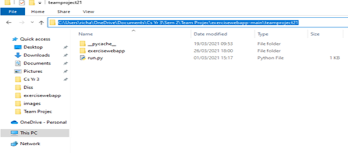

# Exercise Web App

Exercise web application using Flask for a university team project. This project will allow the users to upload exersises with video evidence to their friend group.
Other members of the same group will then be able to upvote or downvote if they feel the video evidence was satisfactory to what exersise they said they done.

## How to use 

To make use of the website full funstionality you must create 3 different user accounts. On one account create a group and take note of the group ID. For each account create a post and upload it making sure to use the same group ID. The post will then apear on the home page each account will have to upvote the other accounts posts. When a post gets upvotes equaling to the majority of members in the group it will then be uploaded to the leaderboard which you can see on the My Groups page. On this page you can see previous posts and a datachart comparing the accounts posts and their progress between each post.

## Installation guide

[Python Download](https://www.python.org/downloads/)

1. To begin with, install Python for your operating system using the link above.
2. Next, download our project file called “teamproject21”(ask Anthony where it will be )
3. Open the command prompt, this can be done by typing “cmd” in the search bar if you are on windows.
4. Save the project file to your desktop.
5.Locate the project file and open up teamproject21.
6. Click to the right of your file name until it is highlighted as shown below and copy it.

